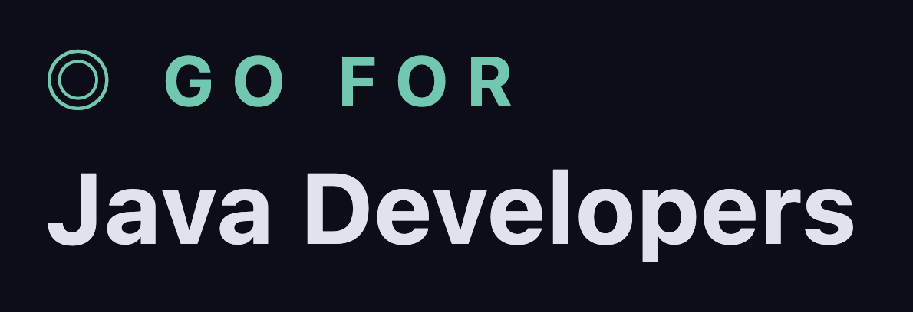

<!-- markdownlint-disable MD033 -->

<p align="center">
  
</p>

## Go for Java Developers

Go for Java Developers is a static, section-based learning site that teaches Go concepts using Java-first mental models and code comparisons.

The site is built with Next.js App Router and pre-renders all section pages at build time for fast delivery and strong SEO.

## What This Project Includes

- 21 guided sections from mental model to project layout
- Java vs Go side-by-side code blocks
- Structured content blocks (`prose`, `compare`, `codeblock`, `note`, `callout`, etc.)
- Syntax-highlighted examples
- SEO metadata, sitemap, and robots routes

## Run Locally

```bash
npm install
npm run dev
```

Open [http://localhost:3000](http://localhost:3000).

## Build

```bash
npm run lint
npm run build
npm start
```

## Content Source

Section content lives in:

- `src/data/sections/*.ts`

Rendering and block UI live in:

- `src/components/SectionRenderer.tsx`
- `src/components/ui.tsx`

## Contributing

Please read [CONTRIBUTING.md](./CONTRIBUTING.md) for:

- how to add a section
- how to edit content safely
- block type definitions and usage patterns
