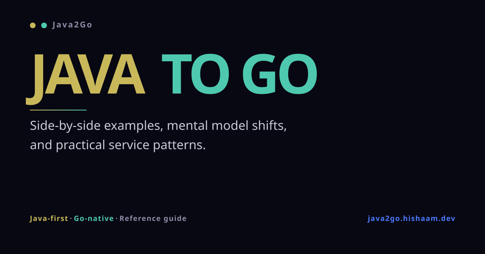

<!-- markdownlint-disable MD033 -->

<p align="center">
  
</p>

# Go for Java Developers

**[java2go.hishaam.dev](https://java2go.hishaam.dev)** · A guide to Go for developers who already know Java.

Every concept starts from the Java you know, shows idiomatic Go next to it, and explains _why_ Go made a different choice, so you build the mental model instead of translating syntax. The content is written against **Go 1.27** and **Java 25**, and calls out when a feature is recent.

## What's inside

31 sections in seven parts:

| Part                     | Sections                                                                                                                                                  |
| ------------------------ | --------------------------------------------------------------------------------------------------------------------------------------------------------- |
| **Orientation**          | Go mental model · Packages & imports · Dependency management                                                                                              |
| **Types & Data**         | Types & variables · Strings & formatting · Structs · Interfaces · Pointers · `any` · Slices & maps                                                        |
| **Functions & Errors**   | Functions · Defer · Error handling · Blank identifier                                                                                                     |
| **Concurrency**          | Goroutines · Channels · Sync primitives · Goroutine management · Context · Defer (advanced)                                                               |
| **Generics & Iterators** | Generics · Iterators                                                                                                                                      |
| **Building Services**    | Init & main lifecycle · Project layout & ecosystem · JSON & HTTP APIs · HTTP concurrency model · Testing · Logging & observability · Tooling & deployment |
| **Wrap-up**              | Common gotchas · Recap                                                                                                                                    |

Site features:

- Java and Go examples side by side, syntax-highlighted at build time
- Full-text search across sections, headings and Java vocabulary (<kbd>⌘K</kbd> / <kbd>Ctrl K</kbd> or <kbd>/</kbd>)
- An "On this page" table of contents with scroll tracking, and linkable headings
- Keyboard- and screen-reader-friendly navigation, a collapsible sidebar and a mobile drawer
- Static pages with per-section Open Graph images, structured data, a sitemap and robots rules

## Tech stack

[](https://nextjs.org/)
[](https://react.dev/)
[](https://www.typescriptlang.org/)
[](https://tailwindcss.com/)
[](https://shiki.style/)
[](https://bun.sh/)

## Run locally

Requires [Bun](https://bun.sh/) 1.3+ (or Node.js 20.9+ with npm).

```bash
bun install
bun run dev
```

Open [http://localhost:3000](http://localhost:3000).

## Scripts

| Command            | What it does                                        |
| ------------------ | --------------------------------------------------- |
| `bun run dev`      | Start the development server                        |
| `bun run build`    | Production build (also validates all guide content) |
| `bun run start`    | Serve the production build                          |
| `bun run check`    | Type-check, lint and verify formatting              |
| `bun run lint:fix` | Fix lint problems where possible                    |
| `bun run format`   | Format everything with Prettier                     |

## Project structure

```text
src/
├── app/                    routes, metadata, OG images, sitemap, search index
├── components/             renderer, code blocks, navigation, search
├── data/sections/          the guide: one file per section, ordered in index.ts
├── lib/                    highlighting, slugs, search, site config
└── types/section.ts        the content block schema
```

Content is plain TypeScript data. `next build` validates it and fails with a clear message on empty blocks, malformed tables, duplicate ids, or internal links that point to a missing section or heading.

## Contributing

Corrections and new content are welcome. Read [CONTRIBUTING.md](./CONTRIBUTING.md) for how sections are structured and how to add one.

## License

[GPL-3.0](./LICENSE) © Md Hishaam Akhtar
